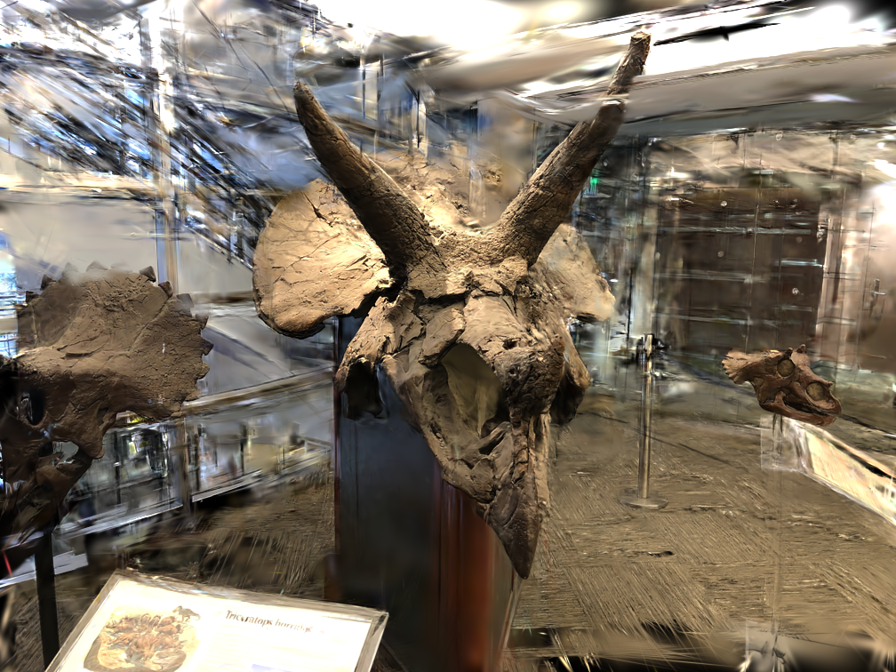
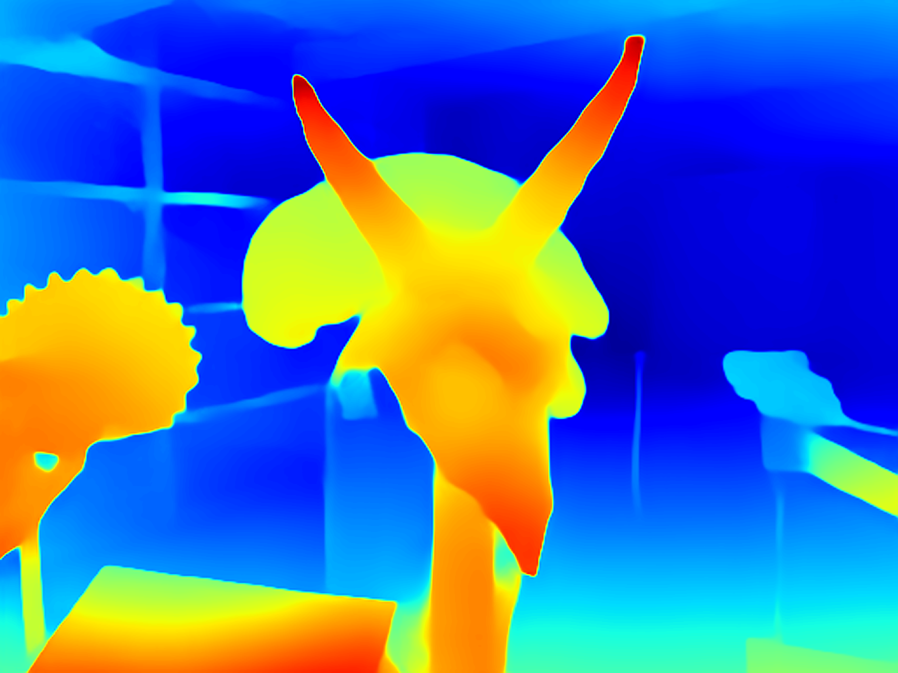
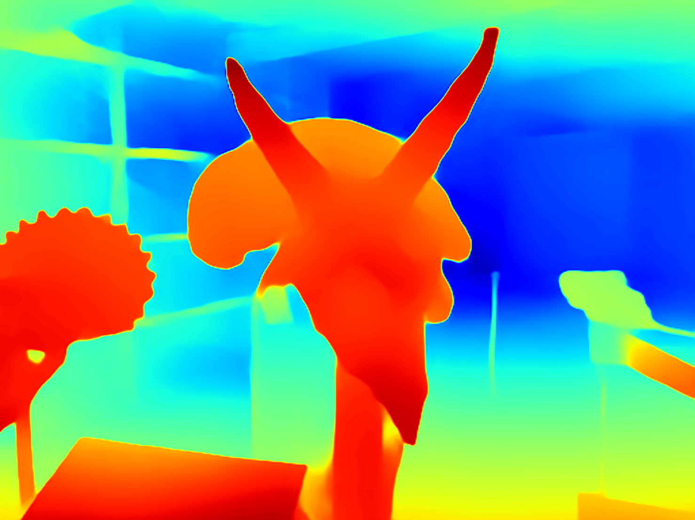
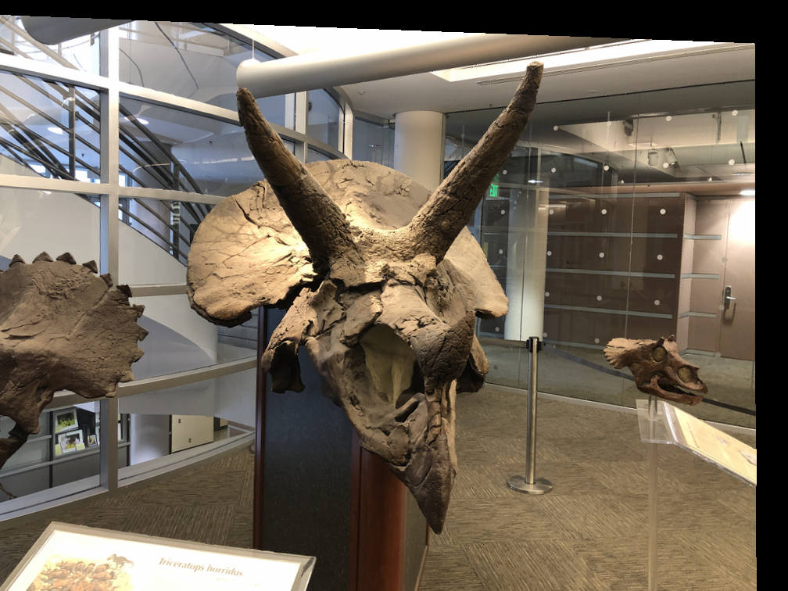
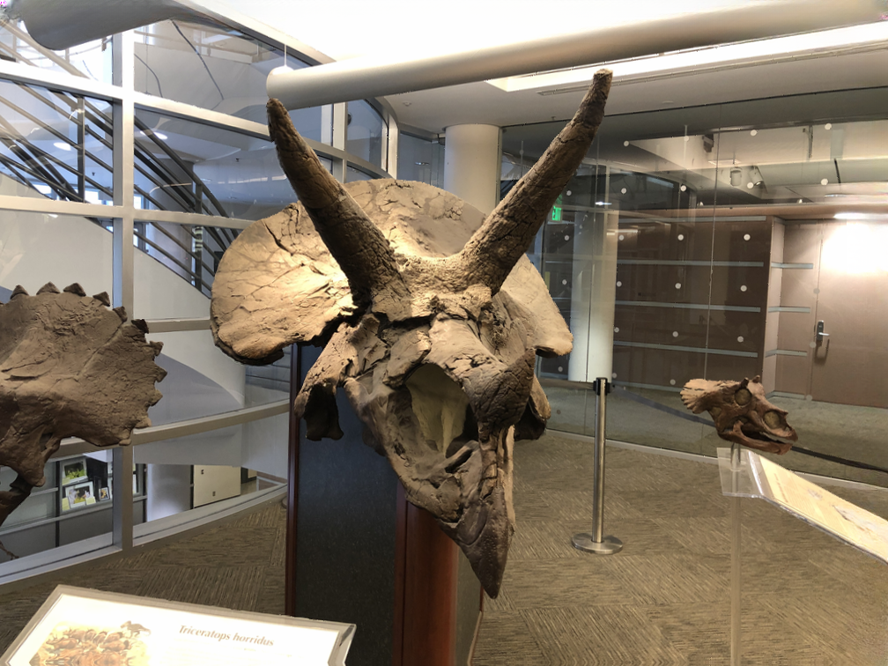
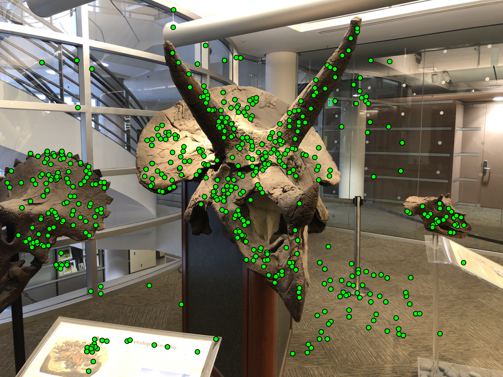
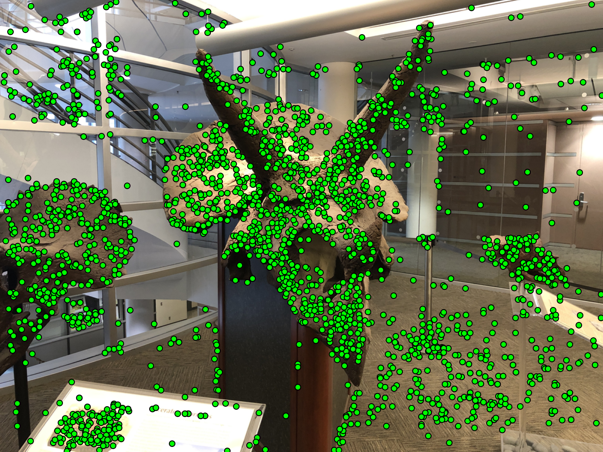
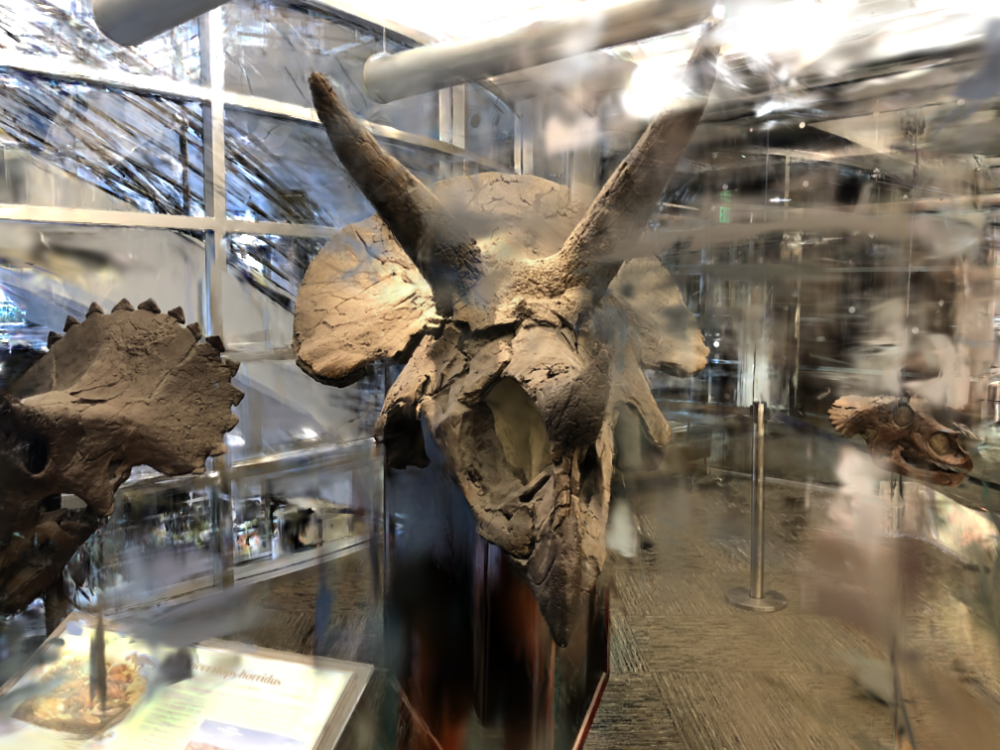
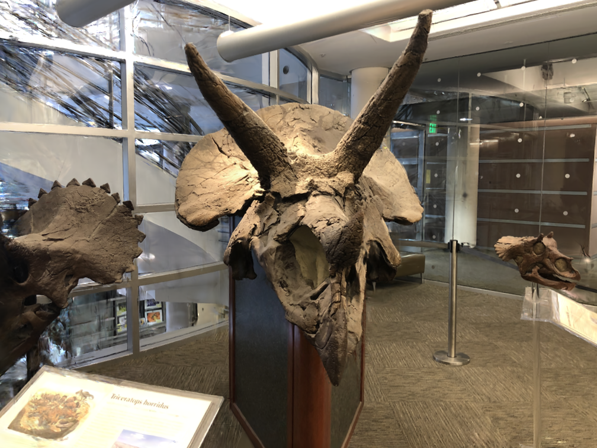

# Pseudo View Generation and Regularization for Sparse 3D Gaussian Splatting

This project proposes a **geometry-aware pre-processing and training-time regularization framework** for improving **3D Gaussian Splatting (3DGS)** under **sparse-view settings**. The core idea is to mitigate poor initialization, overfitting, and geometric inconsistency by generating **pseudo views via image warping**, followed by **geometry-aware densification and regularization**.

---

## Motivation

3D Gaussian Splatting performs well when sufficient input views are available.  
However, with **very sparse views (e.g., 3 views)**, we observe:

- Sparse and unreliable initial point clouds
- Rapid overfitting within a few training epochs
- Inconsistent and noisy geometry reconstruction

  

---

## Key Contributions

- **Pseudo-view generation via geometry-aware image warping**
- **Depth scale alignment** between MiDaS and SfM depths
- **Improved Gaussian initialization** using pseudo views + COLMAP
- **Pseudo-view regularization during training**
- **Segmentation- and depth-guided Gaussian selection and pruning**
- Detailed empirical analysis of **what works and what fails**

---

## Method Overview

### 1. Depth Scale Alignment

MiDaS provides relative depth, while SfM yields sparse metric depth.  
We align MiDaS depth to the SfM scale using a per-image linear regression:

$\hat{d} = a \tilde{d} + b$

This produces **dense, metric-consistent depth maps** suitable for geometry-aware warping.

  
  

  <em>MiDaS inverse depth (left) and SfM-aligned inverse depth (right).</em>

---

### 2. Pseudo View Generation via Image Warping

Given aligned depth, camera intrinsics, and poses:

- Unproject pixels to 3D
- Perturb camera pose (rotation + translation)
- Reproject points into novel viewpoints
- Apply lightweight inpainting to handle occlusions

  
  

---

### 3. Improved Initialization with Pseudo Views

For each original image, we generate **10 pseudo views** and run COLMAP.

**Example (Horn dataset, 3-view setting):**

| Initialization | # Initial Points |
|----------------|------------------|
| 3 views | 590 |
| 3 views + 30 pseudo views | 8,115 |

  
  

---

## Pseudo Views as Training-Time Regularization

Pre-processing alone cannot fully prevent overfitting.  
We therefore introduce **pseudo-view regularization during training**:

- Render pseudo cameras by perturbing pose
- Apply photometric loss only on visible pixels
- No inpainting during training
- Applied periodically (every 5 steps)

This improves geometry smoothness and stability.

---

## Experimental Results

### Horn Dataset

| Initialization | SSIM | PSNR |
|----------------|------|------|
| 3 views | 0.478 | 16.75 |
| 3 views + stereo fusion | 0.655 | 19.13 |
| 3 views + pseudo views | 0.658 | 18.94 |
| 3 views + pseudo + stereo | **0.684** | **19.87** |
| + pseudo regularization | **0.698** | **19.87** |

---

### Fern Dataset

Pseudo views contribute more due to fewer test views.

| Initialization | SSIM | PSNR |
|----------------|------|------|
| 3 views | 0.525 | 17.35 |
| 3 views + pseudo + stereo | 0.659 | 20.30 |
| + pseudo regularization | **0.660** | **20.49** |

---

## Geometry-Aware Gaussian Selection

### Segmentation Mask Guided Selection

- Generate pixel-level masks using a pre-trained segmentation model
- Select Gaussians contributing to masked regions via gradient-based filtering
- Constrain densification and pruning within semantic regions

<!-- 

  
  

 -->

---

## What Failed (Important)

### Density-Based Pruning (Failed)

- Gradient-based selection highlights both valid Gaussians and floaters
- Smooth regions were mistakenly pruned
- Resulted in loss of meaningful geometry

---

## Depth-Based Pruning (Partially Successful)

- Perform depth binning + connected component analysis
- Apply z-score pruning within depth-consistent regions

Results:
- Works well when depth prior is reliable (Horn dataset, Pearson ≈ 0.83)
- Fails when depth prior is noisy (Fern dataset, Pearson ≈ 0.39)

<!-- 

  

 -->

---

## Qualitative results

 

  
  

  <em>3 views (left) and 3 views + pseudo view regularisation (right).</em>

## Comparison with Existing Methods

| Method | Regularization Strategy |
|------|--------------------------|
| FSGS | Depth consistency via MiDaS |
| Cor-GS | Cross-render photometric consistency |
| **Ours** | Geometry-aware pseudo views + depth-aware pruning |

Our approach improves **initialization quality**, **geometry consistency**, and **training stability**, especially in extremely sparse-view regimes.

---

## Takeaways

- Pseudo views are effective both as **pre-processing** and **regularization**
- Depth alignment is critical for geometry consistency
- Not all pruning strategies work — depth quality matters
- Explicit failure analysis is essential for robust system design

---

## Future Work

- Learning-based view synthesis instead of deterministic warping
- Confidence-aware depth pruning
- Joint optimization of pseudo-view selection and densification

---
